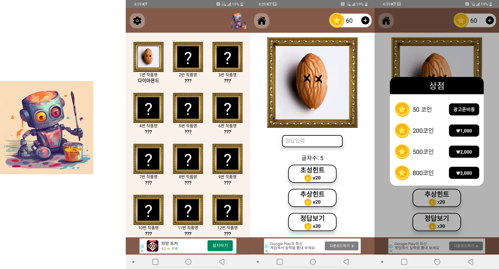

# 넌센스 AI 그림퀴즈

**Midjourney AI**를 사용하여 고품질의 퀴즈 이미지를 생성한 **그림 퀴즈 게임**입니다.



## 프로젝트 요약

기존의 넌센스 퀴즈 게임들이 가진 낮은 품질의 그림 문제를 개선하고자, **그림 생성 AI(Midjourney)**를 활용하여 시각적으로 뛰어난 퀴즈 이미지를 제작했습니다. 이를 통해 사용자들에게 더 높은 몰입감과 재미를 선사하는 것을 목표로 합니다.

- **웹사이트**: [https://nonsense-quiz-k66oww45s-mingyushim94.vercel.app/](https://nonsense-quiz-k66oww45s-mingyushim94.vercel.app/)

## 기술 요약

- **React Native**: 크로스플랫폼 모바일 앱 개발
- **AsyncStorage**: 사용자 데이터(퀴즈 기록, 코인) 로컬 저장
- **AdMob**: 배너 및 보상형 광고를 통한 수익 창출
- **In-app Purchase**: 인앱 결제 기능 (구현 예정)
- **Midjourney**: 퀴즈 이미지, 앱 아이콘, 스플래시 이미지 등 고품질 에셋 제작

## 후기

GPT-3와 같은 언어 모델의 발전은 AI 기술에 대한 관심을 증폭시켰습니다. 처음에는 API를 활용한 어플리케이션을 구상했지만, 비용 문제로 인해 무료 앱으로 출시하기 어렵다고 판단했습니다. 대안으로 그림 생성 AI에 주목하게 되었고, 이를 활용하여 기존의 넌센스 퀴즈를 재해석하는 아이디어를 떠올렸습니다.

과거의 넌센스 퀴즈는 조악한 그림체가 특징이었지만, 저는 Midjourney를 통해 이 부분을 혁신할 수 있다고 생각했습니다. 고품질의 AI 생성 이미지를 활용한다면, 사용자들에게 새로운 시각적 경험과 재미를 제공할 수 있을 것이라 확신했습니다.

개발 과정에서 Midjourney를 능숙하게 다루는 능력을 기를 수 있었을 뿐만 아니라, 앱 아이콘과 스플래시 이미지 제작에도 활용하여 적은 노력으로 높은 디자인 완성도를 달성할 수 있었습니다. 1인 개발 환경에서는 시각적 요소에 소홀해지기 쉬운데, Midjourney 덕분에 개발 시간을 단축하고 앱의 전반적인 퀄리티를 크게 향상시킬 수 있었습니다.

## 실행 방법

```bash
# 의존성 설치
npm install

# iOS 실행
npm run ios

# Android 실행
npm run android
```

## 개인정보처리방침

자세한 개인정보처리방침은 `넌센스AI그림퀴즈.html` 파일을 참고해주세요.
